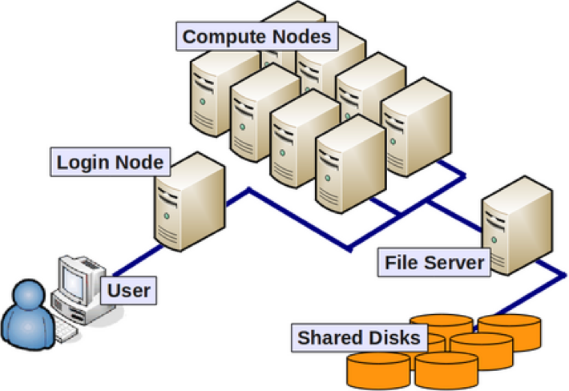

# Install Software

Check you have an SSH and VNC client installed. See the <a href="{{ relative_root_path }}">Setup</a> page for more details.

# Test SSH

`ssh a.<aber user id>@vnc.sunbird.swansea.ac.uk`

# Quick overview of Supercomputing Wales

## Parts of a High Performance Computing System

* Login nodes
* Compute nodes
* Storage

## Swansea Sunbird System

|Partition|Number of Nodes|Cores per node|RAM|Other|
|-------|----|----|------|----|------|
|Compute|122|40|382GB||
|GPU|4|40|382GB|2x Nvidia V100 (5120 core, 16GB RAM)|

800TB scratch drive and 200TB home directory. Neither are backed up.

