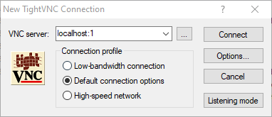
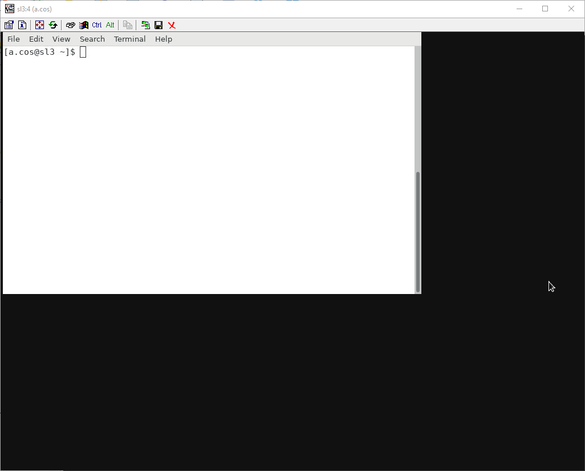
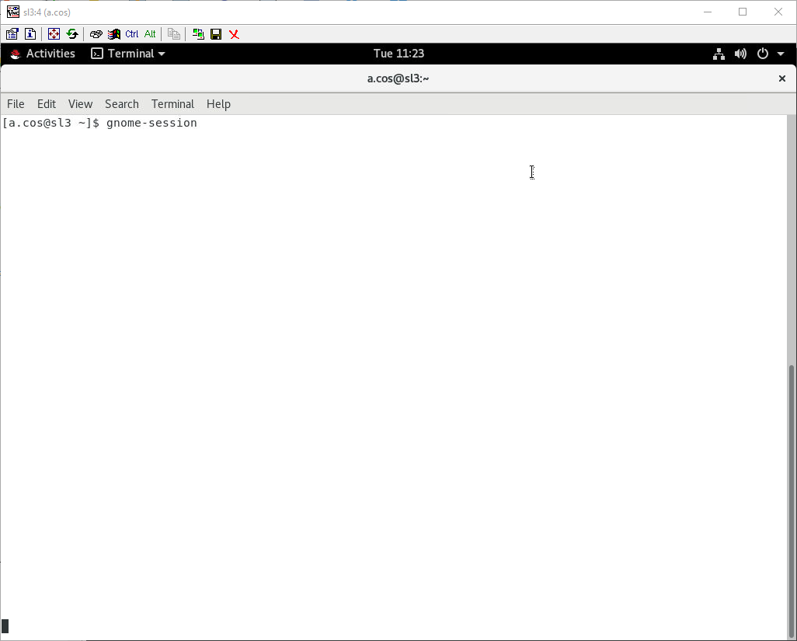
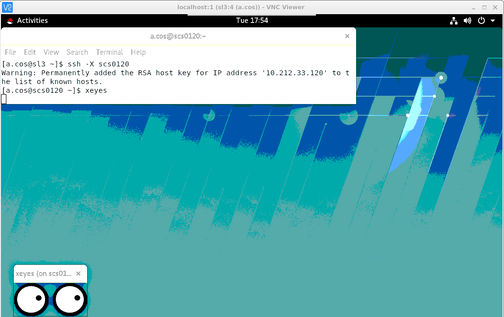
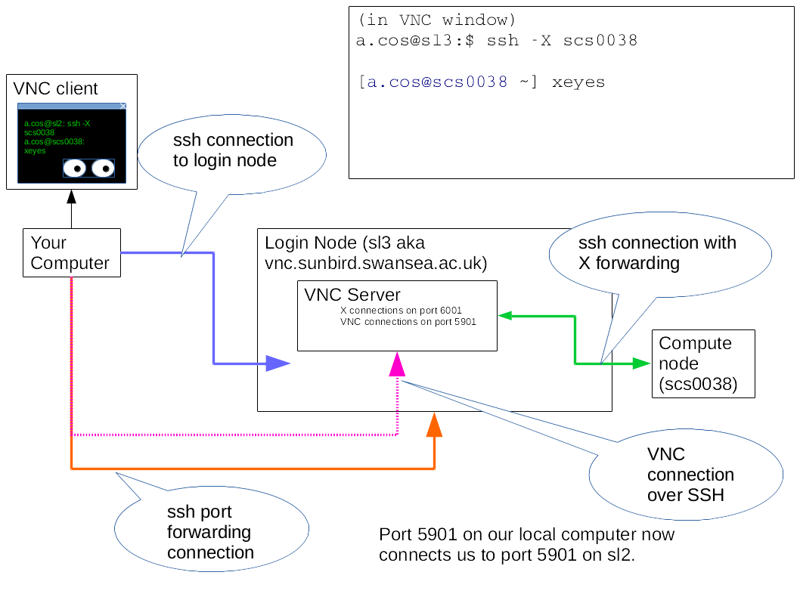

# VNC

## Running a VNC server

We can start a VNC server by logging into `vnc.sunbird.swansea.ac.uk` and running the program `vncserver`. The first time you do this you'll be prompted to create a password for you VNC server, this is different to your normal SCW password. Only the first eight characters of this password will be saved and the method for saving it isn't secure, so don't reuse a password from elsewhere. 

~~~
$ ssh a.abc1@vnc.sunbird.swansea.ac.uk
[a.abc1@sl3 ~]$ vncserver

You will require a password to access your desktops.

Password:
Verify:
Would you like to enter a view-only password (y/n)? n
A view-only password is not used

New 'sl3:4 (a.abc1)' desktop is sl3:4

Starting applications specified in /home/a.abc1/.vnc/xstartup
Log file is /home/a.abc1/.vnc/sl3:4.log
~~~
{: .bash}

We've launched a new VNC server and its server number 4. Keep note of this number, you'll need it again in a minute.

## Opening an SSH tunnel

VNC is now listening on port 5900 + our server number, so in this example we have server number 4 and the port number is 5904. Unfortunately the firewall configuration blocks incoming requests on these ports, we have to use an SSH tunnel to access it. An SSH tunnel puts all the data from a remote server through an SSH connection and then re-presents it on a different port on our local system. If we run:

~~~
ssh a.abc1@vnc.sunbird.swansea.ac.uk -L 5901:localhost:5904
~~~
{: .bash}

It will map port 5901 on the local system to port 5904 on Sunbird. Our VNC client can now connect to port 5901 on the local system and it will actually get access to port 5904 on Sunbird.

When connecting a helpful message will be displayed telling you about your VNC session(s) and reminding you of the command to connect:

~~~
TigerVNC server sessions:

X DISPLAY #     PROCESS ID
:4              142658
Your VNCServer port is set to 5904
Connect with a tunnel using ssh:  ssh -L 5900:localhost:5904 a.abc1@vnc.sunbird.swansea.ac.uk
~~~
{: .bash}

You can also list the running VNC servers with the command `vncserver --list`.

~~~
### VNC clients with built in port fowarding
~~~
{: .callout}

## Launching a VNC client

Run a VNC viewer and connect to localhost port 1 or 5901. If you have a command line VNC client use:

~~~
vncviewer localhost:1
~~~
{: .bash}

Or if you are running a graphical client then enter `localhost` in the hostname box and `1` or `5901` in the port number. 

### VNC only launches a terminal with no window controls or has a black screen

Depending on the contents of your `.vnc/xstartup` file VNC might start without a window manager. This might cause either a black screen or just a terminal with a white background and no window controls. To fix this type the following into your SSH session, replacing `:4` with the number of your VNC server. 

~~~
export DISPLAY=:4
xterm &
~~~
{: .bash}

A white terminal should now appear in the VNC session, in this now type `gnome-session` and some menus and window controls will appear. 

## Connecting to a graphical application on a compute node

So far we've got a VNC server running on the login node, but any computational software should run on a compute node. To do this we first need to get an allocation on a compute node by running `salloc -n1 -t 1:00:00` (Which will allocate 1 CPU core with a 1 hour time limit) and then login with X Windows display forwarding by using the SSH command with the `-X` option. We can test this by running the command xeyes, this should bring up a window with two eyes that follow the mouse pointer. The window title should say "xeyes (on scs0XXX)" (where XXX is a number between 001 and 126).

~~~
[a.abc1@sl3 ~]$ salloc -n1 -t 1:00:00
salloc: Granted job allocation 188111
salloc: Waiting for resource configuration
salloc: Nodes scs0120 are ready for job

[a.abc1@sl3 ~]$ ssh -X scs0120
[a.abc1@scs0120 ~]
~~~
{: .bash}

### Ending an interactive session

After running an interactive session be sure to do the following:

- Logout of the compute node by typing exit
- End the job allocation by typing exit again or using the scancel command.

## An overview of how all this fits together

